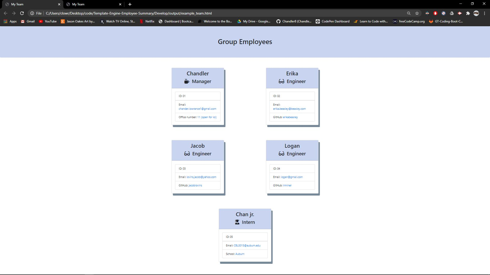
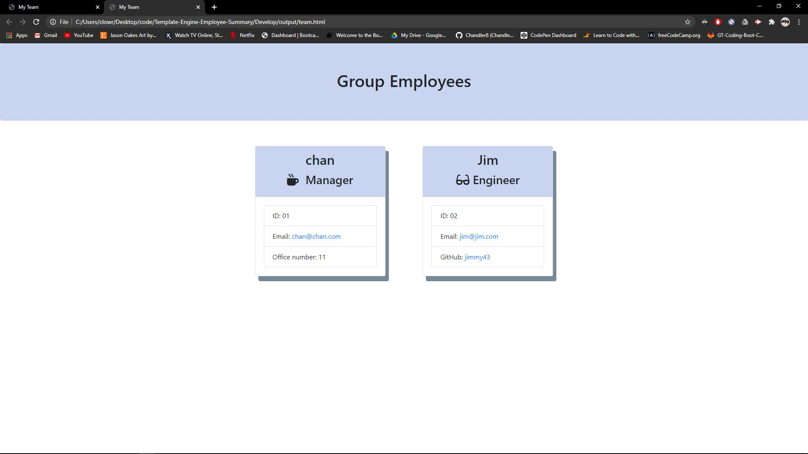
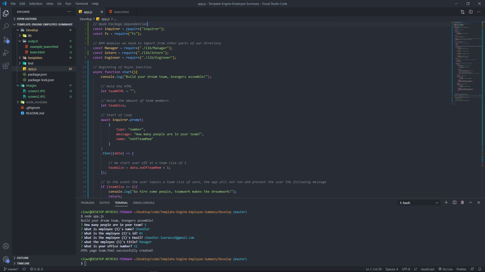

# Employee Template Generator


The following is a Node.js based command line application that allows users to dynamically generate an HTML file pre-desigend to hold summaries of their engineering team. This app takes in user input regarding the roles and specifications of a small team to create a simple but effetive means of team organziation. If the user finds themselves unsure about how they would like to structure their small team, then this is the perfect app for them. Within this app you will find Node.js, custom NPM modules, jest testing, Inquirer, and others. This application has passed testing and has been ran through all validation services. By eliminating the hassle of trying to manually create an employee work flow chart as a manager, this app will give users more time to focus on the quality of their work! 

## Features

A few of the things you can do with Employee Template Generator:

* Input your unique information into the CLI to generate small teams tailored to your needs.
* Please see the example_team.html file within the repository to view a generated example.
* Easily create a build out of your team that covers important information about employees including:
```
Name
Job Title
ID Number
Email Address
Office Number (Managers)
Github Link (Engineers)
School (Interns)
```

## User Story

```
As a manager
I want to generate a webpage that displays my team's basic info
So that I have quick access to emails and GitHub profiles
```

## Table of Contents


* [Installation](#installation)
* [License](#license)
* [Questions](#questions)
* [Contributors](#contributors)
* [Images](#images)

# Installation

Before you run this application, please enter into your terminal:
- npm install
- npm install inquirer
- npm install jest
- npm install util
- npm install axios

After you have done this, to run the application, please enter into your terminal: 
- node app.js

# License

Application working under an MIT license

# Questions

Reach out to me via email regarding any questions or concerns with this project:
- chandler.lowrance1@gmail.com


# Contributors

| Chandler
------------ 

[<br /><sub><b>Chandler Lowrance</b></sub>](https://github.com/Chandler8)<br />[💻](https://github.com/Chandler8?tab=repositories "Repositories")

# Media




